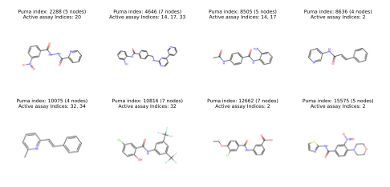
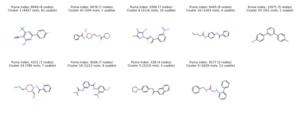

# Omics-Guided GflowNets

## Description
This repository contains the code to run the experiments and visualize the results in the [Cell Morphology-Guided Small Molecule Generation with GFlowNets](https://arxiv.org/abs/2408.05196) paper. Our codebase builds on top of a fork of the public [Recursion gflownet](https://github.com/recursionpharma/gflownet) repo which provides the environment setup to run the GFlowNets framework on graph domains. We also use a second submodule for training multimodal contrastive learning models (GMC, CLIP) which we use to derive a reward signal for the GFlowNets. See the paper for more details. Please contact the [authors](mailto:stephen.lu@mila.quebec) for further information.

## Setup
To setup the project, first create a conda environment with `python=3.10`
```bash
conda create -n <env_name> python=3.10
conda activate <env_name>
```

Then, pull the submodules and install them accordingly.

```bash
git submodule update --init --recursive --remote

# For the gflownet submodule, run
cd gflownet
pip install -e . --find-links https://data.pyg.org/whl/torch-2.1.2+cu121.html

# For the gmc submodule, run
cd multimodal_contrastive
pip install -r requirements.txt
pip install -e .
```

## Usage
The current project supports training GFlowNets or (the baselines in the paper: SAC, SQL, Random) from scratch and reproducing the plots in the paper. You may also load some of our GFlowNet checkpoints and generate your own samples from the fragment set that we trained on. The instructions for each of these tasks are provided below.

## Training from scratch
We currently support training from scratch against one of the 17 targets in the `morph` or `joint` settings that we used in the paper. Further, we provide a checkpoint for the GMC proxy model that we used to derive the reward signal for the GFlowNets. Here is the structural modality of the targets that we used in the paper:




#### Download Checkpoint and Targets
Before training, you must first download the [checkpoint](https://drive.google.com/file/d/18zWv01v57GDg165hu-XPZDx3Pyyr9x_b/view?usp=drive_link) for our GMC proxy model as well as a target profile (saved as `.pkl` file) from our [drive](https://drive.google.com/drive/folders/1q-YqF2F7cvnK4Mr_thmI_CKRDYvjHLRs?usp=sharing).

>The GMC checkpoint is used to derive the reward signal for the GFlowNets. The target profiles contain an associated **morphological** and **structural** profile that we want to optimize for in either the `morph` or `joint` training settings. Refer to the paper for more details.

#### Train Single Run Locally
To train a model from scratch, you may choose to either run the training script directly or run a sweep with wandb. To run the training script directly, modify the hyperparameters at the bottom of the `gflownet/src/gflownet/tasks/morph_frag.py` script, making sure that you specify the path to the GMC checkpoint and target profile that you downloaded earlier.

```python
config.task.morph_sim.target_path = "path.to/sample_338.pkl"
config.task.morph_sim.proxy_path = "path.to/mmc_proxy.ckpt"
```

Finally, run the training script with the following command:
```bash
python gflownet/src/gflownet/tasks/morph_frag.py
```

A full description of the hyperparameters can be found in the `gflownet/src/gflownet/config.py` file. Notably for our experiments, these are the most important hyperparameters:

- `config.algo.method`: The generative method to use (GFlowNet, SAC, SQL, Random)
- `config.algo.max_nodes`: The maximum number of fragments to use for generation
- `config.task.morph_sim.target_mode`: Whether to use the morphological or joint target profile
- `config.cond.temperature.dist_params`: The GFlowNet temperature parameter
- `config.algo.train_random_action_prob`: The probability of taking a random action during training
- `config.task.morph_sim.target_path`: The path to the target profile
- `config.task.morph_sim.proxy_path`: The path to the GMC checkpoint

#### Run Sweep with Wandb
To run a sweep, please edit the sweep parameters in `sweeps/morph_sim_sweep.py`, then follow the instructions in the `sweeps/README.md` to launch the sweep. We use slurm to launch jobs and have provided shell script under `sweeps/` to do so, but it should be rather simple to adapt these to your environment. Once again, make sure to specify the path to the GMC checkpoint and target profile in the sweep script. The config schema can be found at `gflownet/src/gflownet/config.py`.

## Loading Checkpoints and Generating Samples

For the paper, we trained all four methods (GFlowNet, SAC, SQL, Random) on 17 targets in both the `morph` and `joint` settings. We've uploaded the training samples, logs, and checkpoints of all 136 runs to our [drive](https://drive.google.com/drive/folders/1CFY9YHJsGGDYggwI7TCJhlssZDe_CuZK?usp=sharing).

To load a checkpoint and generate new samples from a trained GFlowNet, please download a run folder from the drive (e.g. [proud-sweep-1-id-nshn5fcc](https://drive.google.com/drive/folders/1ekgu46TvSoN1bu9i-2-ugAW3tsLdOInu?usp=sharing) for a GFlowNet trained in `morph` setting on target `#2288`)

>Descriptions of the run folders can be found in `runs/morph.json` for the `morph` setting and `runs/joint.json` for the `joint` setting runs. Please use these files to choose which run you would like to download.

Finally, please refer to the `notebooks/sample.ipynb` notebook for an example of how to load a checkpoint and generate samples from a trained GFlowNet.

## Plotting
To reproduce plots from the paper, you will likely have to download all the runs from the drive which will result in a large download. This is because most of our plots are aggregated across all targets and compare the performance of all four methods. Once you have downloaded the runs, please follow the instructions in `vis/README.md` to reproduce the plots.

## Citation
If you use this codebase in your research, please cite the following paper:
```
@misc{lu2024cellmorphologyguidedsmallmolecule,
      title={Cell Morphology-Guided Small Molecule Generation with GFlowNets}, 
      author={Stephen Zhewen Lu and Ziqing Lu and Ehsan Hajiramezanali and Tommaso Biancalani and Yoshua Bengio and Gabriele Scalia and Michał Koziarski},
      year={2024},
      eprint={2408.05196},
      archivePrefix={arXiv},
      primaryClass={cs.LG},
      url={https://arxiv.org/abs/2408.05196}, 
}
```
